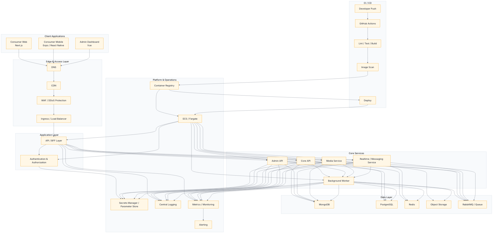

  

  
  

  

---

## 🧠 About Me

Software Developer focused on building scalable, cloud-native, distributed systems.

**Focus areas**
- Product engineering  
- System architecture  
- Distributed systems  
- Event-driven design  
- Cloud-native infrastructure  

**Core stack**
- Backend: Node.js, Express, GraphQL, RabbitMQ  
- Frontend: React, Next.js  
- Mobile: React Native, Expo  
- Cloud: AWS, Docker, Nginx  

🌍 Open to global opportunities.

---

## ⚡ Tech Arsenal

  
   
  
   
  

---

## 🏗 System Architecture Focus

  
  
  
  
  

---

## 🏆 Featured Projects

- 🧠 Scalable Social Media Platform  
  Web + Mobile + Realtime + Event-driven architecture  
  React • React Native • GraphQL • RabbitMQ • AWS  

- ⚡ Event-Driven Backend Architecture  
  Node.js • GraphQL • RabbitMQ • Redis • Docker  

- 🏗 Microfrontend Monorepo System  
  Next.js • Module Federation • Nx  

(Pinned repositories below 👇)

---

## 📊 Metrics

  

  

---

## 🧬 Engineering Philosophy

“Clean code is not written by following rules.  
Clean code is written by caring.”

- System-first thinking  
- Scalable foundations  
- Product-driven engineering  
- Performance obsession  
- Automation mindset  

---

## 🤝 Connect

- LinkedIn → https://tr.linkedin.com/in/canberk-beren  
- Mail → canberkberen@icloud.com  

## Wuubi - Project Architecture Mermaid

- Full Preview → https://mermaid.ai/d/62af7a04-b1b3-4e06-8f69-aea59d72c61a

---

  

